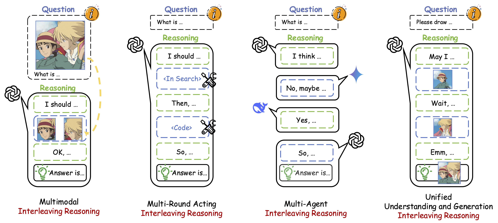
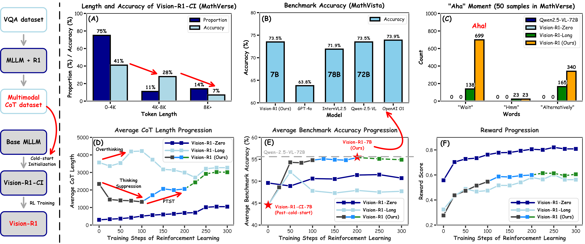
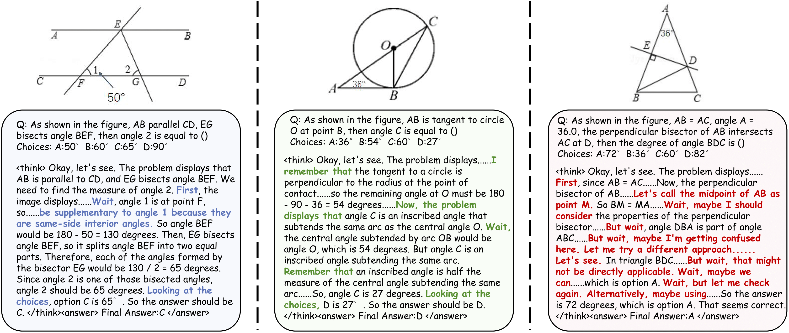
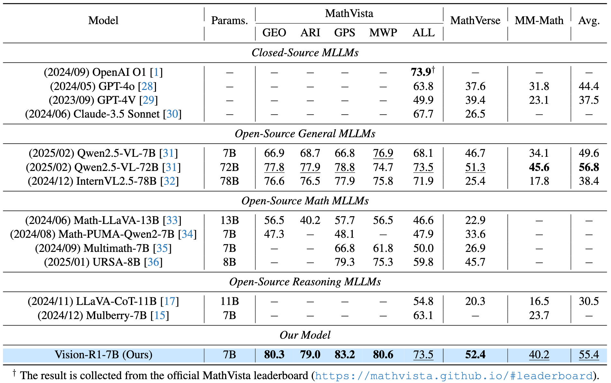
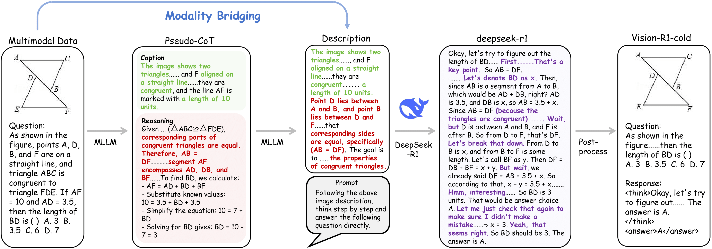
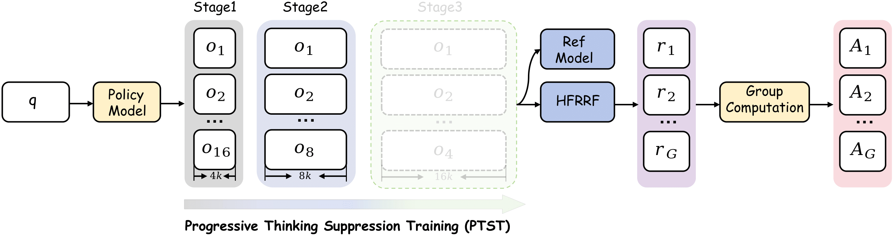

# Vision-R1

The official repo for "Vision-R1: Incentivizing Reasoning Capability in Multimodal Large Language Models".

<p align="center">
       🤗 <a href="https://huggingface.co/datasets/Osilly/Vision-R1-cold">Cold-start Dataset (Vision-R1-cold)</a>&nbsp&nbsp | &nbsp&nbsp🤗 <a href="https://huggingface.co/datasets/Osilly/Vision-R1-rl">RL Dataset (Vision-R1-rl)</a>&nbsp&nbsp
</p>

<p align="center">
       🤗 <a href="https://huggingface.co/Osilly/Vision-R1-CI-7B">Vision-R1-CI-7B</a>&nbsp&nbsp | &nbsp&nbsp🤗 <a href="https://huggingface.co/Osilly/Vision-R1-7B">Vision-R1-7B</a>&nbsp&nbsp | &nbsp&nbsp🤗 <a href="https://huggingface.co/Osilly/Vision-R1-32B">Vision-R1-32B</a>&nbsp&nbsp | &nbsp&nbsp🤗 <a href="https://huggingface.co/Osilly/Vision-R1-72B">Vision-R1-72B</a>&nbsp&nbsp | &nbsp&nbsp📑 <a href="https://arxiv.org/abs/2503.06749">Paper</a>&nbsp&nbsp
</p>
The datasets, code and weights will be released, stay tuned!

## Performance

| Model                      | MathVista   | MathVerse    | MathVerse (mini Vision_Only) | MM-Math      | DynaMath (Overall; Avg) | AVG.         |
| -------------------------- | ----------- | ------------ | ---------------------------- | ------------ | ----------------------- | ------------ |
| Qwen2.5-VL-7B              | 68.1        | 46.7         | 40.2                         | 34.1         | 50.7                    | 47.9         |
| Qwen2.5-VL-32B             | 72.9        | 52.3         | 47.6                         | 34.9         | 55.5                    | 52.6         |
| Qwen2.5-VL-72B             | 73.5        | 51.3         | 47.3                         | 45.6         | 61.2                    | 55.8         |
| **Vision-R1-7B (Ours)**    | 73.5 (+5.4) | 52.4 (+5.7)  | 46.7 (+6.7)                  | 40.2 (+6.1)  | 56.3 (+5.6)             | 53.8 (+5.9)  |
| **Vision-R1-32B\* (Ours)** | 76.4 (+2.9) | 62.1 (+9.8)  | 59.0 (+11.4)                 | 55.3 (+20.4) | 65.6 (+10.1)            | 63.7 (+11.1) |
| **Vision-R1-72B\* (Ours)** | 78.2 (+4.7) | 63.2 (+11.9) | 57.9 (+10.6)                 | 59.3 (+13.7) | 66.4 (+5.2)             | 65 (+9.2)    |

*: Note that Vision-R1-32B  and Vision-R1-72B  used the additional data in RL training.

## Highlight

---

🔥🔥🔥 **Awesome Interleaving Reasoning**  
<p align="center">
    
</p>

<font size=7><div align='center' > [[🌟 GitHub](https://github.com/Osilly/Awesome-Interleaving-Reasoning)] </div></font>  

<font size=7><div align='center' > Recently, the introduction of [OpenAI o3](https://openai.com/index/introducing-o3-and-o4-mini/), [Deep research](https://openai.com/index/introducing-deep-research/), [Zochi](https://github.com/IntologyAI/Zochi/blob/main/Zochi_Technical_Report.pdf), and [BAGEL](https://arxiv.org/abs/2505.14683) has established an alternative reasoning formulation, which we designate as **Interleaving Reasoning**. In contrast to standard reasoning, Interleaving Reasoning is characterized by multi-turn interactions and exhibits sophisticated reasoning dynamics. This reasoning modality has empirically demonstrated superior accuracy in addressing complex problems. Consequently, we posit that Interleaving Reasoning potentially constitutes the **Next-Generation Reasoning Systems for AGI**.  </div></font>

---

## TODO and Timeline

### TODO

- 🔥 We will release the **datasets, code and weights**!
- 🔥 We are in the process of training for **72B Vision-R1** and plan to release it when it is completed!
- 🔥 We are trying to scale our training to low-resource settings, where the entire cold start and RL training process can be completed **using only 8 GPUs**.

### Timeline

- [2025/06/26] **We released [RL Dataset (Vision-R1-rl)](https://huggingface.co/datasets/Osilly/Vision-R1-rl), [Vision-R1-CI-7B](https://huggingface.co/Osilly/Vision-R1-CI-7B), [Vision-R1-32B](https://huggingface.co/Osilly/Vision-R1-32B, [Vision-R1-72B](https://huggingface.co/Osilly/Vision-R1-72B)** !
- [2025/05/07] We released evalution codes!
- [2025/04/13] **We released [Vision-R1-7B](https://huggingface.co/Osilly/Vision-R1-7B)**!
- [2025/03/24] **We released [Cold-start Dataset (Vision-R1-cold)](https://huggingface.co/datasets/Osilly/Vision-R1-cold)**!
- [2025/03/11] We released the inference code and scripts.
- [2025/03/09] Our Vision-R1 paper ([Vision-R1: Incentivizing Reasoning Capability in Multimodal Large Language Models](https://arxiv.org/abs/2503.06749)) can be accessed in arXiv!

## Our Exploration



> **Left panel:** Our Vision-R1 Pipeline. We first use the existing MLLM and DeepSeek-R1 to obtain a high-quantity Multimodal CoT dataset, which is used as the cold-start initialization data for the base MLLM to obtain the post-cold-start Vision-R1-CI, and then we perform the RL training on Vision-R1-CI to obtain the reasoning MLLM, Vision-R1.
>
> **Right panel:** We observe that directly applying RL to MLLMs fails to effectively incentivize  strong reasoning capability (see (C) and (D)).  Vision-R1-Zero, trained via RL without prior initialization, struggles to generalize from limited data (see (E), (F), notably, Vision-R1-Zero was applied in format reward function). Vision-R1-CI faces the Overthinking Optimization Problem, favoring shorter CoT reasoning, where correct reasoning processes mostly focus on the shorter CoT reasoning sequences (see (A)). During subsequent RL training, we observe a lengthening of reasoning steps but a decline in performance (see (D) and (E)), making optimization particularly challenging. For Vision-R1, it initially shortens CoT to refine the right thought process under RL training. PTST enables Vision-R1 to progressively acquire a more complex reasoning process (see (C), (D), and (E)) to improve the performance, such that our Vision-R1 with 7B parameters achieves comparable performance to the strongest MLLMs with 70B+ parameters (see (B)). Note that Vision-R1 used various colored lines to indicate the different stages in PTST.

## Vision-R1 Reasoning Example




> The output examples of Vision-R1-7B on MathVerse benchmark. Vision-R1-7B shows ''human-like'' questioning and self-reflective thought process when solving math reasoning problems, which is also called **''Aha moment''** in DeepSeek-R1's paper.

## Result



## Pipeline

### Cold-start Initialization Data Preparation



> The overall data generation pipeline incorporating our Modality Bridging method. The multimodal data is first sent to MLLMs to obtain a "Pseudo-CoT'' consisting of a caption and reasoning process, which serves as the input of MLLMs along with the original image-question pair to produce detailed descriptions. Through this modality bridging approach, the textual descriptions provide DeepSeek-R1 with holistic information that facilitates the generation of high-quality CoT processes, which are post-processed and integrated with the original data to create the final Vision-R1-cold dataset.

### RL Training



> GRPO with our proposed PTST strategy.  We progressively loosen the context length restrictions, increasing the length of reasoning process. Specifically, we set the reasoning length to 4K, 8K and 16K tokens for each stage, with corresponding group numbers of 16, 8 and 4 respectively. The reward function for GRPO is based on a hard formatting result reward function (HFRRF). The dotted line in the  ''Stage 3'' indicates that the final version of Vision-R1 did not undergo the third stage of training.

## Quickstart

### Train

#### Cold-start Initialization

##### Data preparation

Download the Cold-start dataset [Vision-R1-cold](https://huggingface.co/datasets/Osilly/Vision-R1-cold).

The images of our Vision-R1-cold dataset can be downloaded from [LLaVA-CoT-100k](https://huggingface.co/datasets/Xkev/LLaVA-CoT-100k) and [Mulberry-SFT](https://huggingface.co/datasets/HuanjinYao/Mulberry-SFT).

Put the images in `llava_cot_images` and `mulberry_images` .

Then, refer [here](https://github.com/hiyouga/LLaMA-Factory/blob/main/data/README.md) and update the following customized dataset into `dataset_info.json` in LLaMA-Factory.

```
"vision_r1_llava_cot_full": {
    "file_name": "vision_r1_llava_cot_full.json",
    "formatting": "sharegpt",
    "columns": {
      "messages": "conversations",
      "images": "image"
    },
    "tags": {
      "role_tag": "from",
      "content_tag": "value",
      "user_tag": "human",
      "assistant_tag": "gpt"
    }
  },
  "vision_r1_mulberry_sft_full": {
    "file_name": "vision_r1_mulberry_sft_full.json",
    "formatting": "sharegpt",
    "columns": {
      "messages": "conversations",
      "images": "images"
    },
    "tags": {
      "role_tag": "from",
      "content_tag": "value",
      "user_tag": "user",
      "assistant_tag": "assistant"
    }
  }
```

The structure of the directory should be:

```
│──vision_r1_cold
│	 ├──llava_cot_images
│	 │	 ├──coco
│	 │	 ├──sqa
│	 │	 ├── ......
│	 ├──mulberry_images
│	 │	 ├──AI2D
│	 │	 ├──chartqa
│	 │	 ├── ......
│	 ├──vision_r1_llava_cot_full.json
│	 ├──vision_r1_mulberry_sft_full.json
│	 ├──dataset_info.json
```

##### Training

We use [LLaMA-Factory](https://github.com/hiyouga/LLaMA-Factory) to obtain the Vision-R1-CI model and put the training script in `train/cold_start`. You can use `8*4` or `8` GPUs of 80G memory to train it.

You should replace the path of Vision-R1-cold dataset for the `train.yaml`, such as [`train/cold_start/vision_r1_full_Qwen2.5-VL-7B-Instruct_sft_epoch2_lr5e6_warm005_32GPU/train.yaml`](https://github.com/Osilly/Vision-R1/blob/main/train/cold_start/vision_r1_full_Qwen2.5-VL-7B-Instruct_sft_epoch2_lr5e6_warm005_32GPU/train.yaml).

```
dataset_dir: /path/of/vision_r1_cold ### Replace it!
```

Then, use the [script](https://github.com/Osilly/Vision-R1/blob/main/train/cold_start/vision_r1_full_Qwen2.5-VL-7B-Instruct_sft_epoch2_lr5e6_warm005_32GPU/deepseed_node.sh) to start the training.

```
bash train/cold_start/vision_r1_full_Qwen2.5-VL-7B-Instruct_sft_epoch2_lr5e6_warm005_32GPU/deepseed_node.sh
```

#### RL Training

The [RL Dataset (Vision-R1-rl)](https://huggingface.co/datasets/Osilly/Vision-R1-rl) uses the [geometry3k](https://huggingface.co/datasets/hiyouga/geometry3k) formation , while you can use [EasyR1](https://github.com/hiyouga/EasyR1) or [verl](https://github.com/volcengine/verl) to finish the training.

### Inference

Install requirements first

```bash
pip install -r requirements.txt
```

(Optional) install Flash Attention2

```bash
pip install -U flash-attn --no-build-isolation
```

#### Using 🤗  Transformers for Inference

Run the command below.

```bash
# Inference script for Vision-R1-7B model using transformers
MODEL_PATH="Vision-R1-7B"   # Replace with your model path
TEMP=0.6
TOP_P=0.95
MAX_TOKENS=4096
# Loacl image path and prompt
IMAGE_PATH="./figs/example1.png"
PROMPT="Given a cone with a base radius represented by the variable 'r' (r = 1) and a slant height represented by the variable 's' (s = 3), determine the lateral surface area using variables.\nChoices:\nA: 2π\nB: 3π\nC: 6π\nD: 8π"

python3 inference.py \
    --model_path ${MODEL_PATH}  \
    --enable_flash_attn True \
    --image_path ${IMAGE_PATH} \
    --prompt "${PROMPT}" \
    --max_tokens ${MAX_TOKENS} \
    --temperature ${TEMP} \
    --top_p ${TOP_P}
```

or modify arguments in `scripts/inference.sh` and run

```bash
sh scripts/inference.sh
```

Note that we use the same `temperature` and `top_p` as [DeepSeek-R1](https://huggingface.co/deepseek-ai/DeepSeek-R1/blob/main/generation_config.json), you can also try other hyper-parameters.

#### Using vLLM for Deployment and Inference

We highly recommend applying vLLM for deployment and inference. vLLM version should satisfy `vllm>0.7.2`.

#### Start an OpenAI API Service

Run the command below to start an OpenAI-compatible API service:

```bash
MODEL_PATH="Vision-R1-7B"   # Replace with your model path
MODEL_NAME="Vision-R1-7B"
# deploy
vllm serve ${MODEL_PATH} \
    --port 8000 \
    --host 0.0.0.0 \
    --dtype bfloat16 \
    --limit-mm-per-prompt image=5 \
    --served-model-name "${MODEL_NAME}" \
```

or using the bash script below:

```bash
sh scripts/vllm_deploy.sh
```

Then, you can use the chat API by running the command below:

```bash
MODEL_PATH="Vision-R1"
TEMP=0.6
TOP_P=0.95
MAX_TOKENS=4096
IMAGE_PATH="./figs/example1.png"
PROMPT="Given a cone with a base radius represented by the variable 'r' (r = 1) and a slant height represented by the variable 's' (s = 3), determine the lateral surface area using variables.\nChoices:\nA: 2π\nB: 3π\nC: 6π\nD: 8π"
python3 vllm_inference.py \
    --model_path ${MODEL_PATH}  \
    --image_path ${IMAGE_PATH} \
    --prompt "${PROMPT}" \
    --max_tokens ${MAX_TOKENS} \
    --temperature ${TEMP} \
    --top_p ${TOP_P} \
    --timeout 2000 
```

or using bash script

```bash
sh scripts/vllm_inference.sh
```

#### Inference Locally

You can also use vLLM to inference locally:

```bash
MODEL_PATH="Vision-R1"
TEMP=0.6
TOP_P=0.95
MAX_TOKENS=4096
IMAGE_PATH="./figs/example1.png"
PROMPT="Given a cone with a base radius represented by the variable 'r' (r = 1) and a slant height represented by the variable 's' (s = 3), determine the lateral surface area using variables.\nChoices:\nA: 2π\nB: 3π\nC: 6π\nD: 8π"
python3 vllm_inference_local.py \
    --model_path ${MODEL_PATH}  \
    --image_path ${IMAGE_PATH} \
    --prompt "${PROMPT}" \
    --max_tokens ${MAX_TOKENS} \
    --temperature ${TEMP} \
    --top_p ${TOP_P} \
```

or using bash script

```bash
sh scripts/vllm_inference.sh
```

### Evalution

We provide our evaluation codes under `evaluation/`, see [README.md](./evaluation/README.md) for more details.

## Star History

[](https://www.star-history.com/#Osilly/Vision-R1&Date)
